# Drawing surfaces, cut systems, and factorizations

A practical tutorial for the current library. **Drawing comes first.** You can
supply curves, cut-system states and factor labels yourself; no calculation
engine is required to lay them out. The runnable source for every numbered
figure is [examples/tutorial.py](../examples/tutorial.py).

## 1. Run the tutorial

From the repository root, in your Python environment:

```powershell
python -m pip install -e .
python examples/tutorial.py
```

This produces seventeen main SVG figures, a full-size cut-disk diagnostic, and seventeen TikZ counterparts in
[examples/output/tutorial](../examples/output/tutorial/). Open SVG files in a
browser or vector editor. Circular-hole figures also export to TikZ.
The [browser edition](TUTORIAL.html) contains the same instructions and figures.

```python
from surface_diagrams import (
    Arc, Loop, PlanarSurface, GenusSurface, Style, save_svg, save_tikz,
    ColoredCurve, PlanarDiagram, BraidDiagram, Panel, Figure, RAINBOW,
)
```

`save_svg(diagram, "figure.svg")` writes a transparent vector image. Use
`scale=2` to enlarge everything uniformly. `save_tikz(diagram, "figure.tikz")`
exports supported geometry for a document loading the TikZ package. To compile
all seventeen TikZ figures, run `pdflatex -halt-on-error tutorial-gallery.tex`
from `examples/output/tutorial`. The gallery fits both the width and height of
each figure to the page, including tall factor/action stacks.

## 2. Use case 1: read a planar surface before entering a curve

```python
surface = PlanarSurface.row("PPPPPP", spacing=55, height=210, margin=60)
save_svg(surface, "input-map.svg", style=Style(show_guides=True))
```


`P` is a marked point. `B` is an inner boundary. Number **both** kinds together
from left to right, starting at 1. A pattern `BPPB` has objects 1 through 4,
not separate boundary and marked-point numbering.

There are two different sorts of numbers in the guide:

| What you are choosing | Allowed values | Example for six objects |
| --- | --- | --- |
| An arc endpoint at an object | 1 through n | Endpoint 2 means the second object |
| An arc endpoint on the outer boundary | 0 or n+1 | 0 is the left tip; 7 is the right tip |
| A crossing of a horizontal interval | 0 through n | Cut 3 is the open gap between objects 3 and 4 |

**The default colored reference system follows these very same horizontal
intervals.** An interval number and an endpoint number still mean different things:
the first is an open interval; the second is a particular outer-boundary point.

For this planar routing API, all object centers must lie on y=0 with distinct
x coordinates. Custom nonhorizontal arrangements can be drawn as surfaces, but
routing on them remains future work. Increase `height` if a curve passes too
close to other points; increase `spacing` if the row is crowded.

## 3. Decide the arc's endpoints and its itinerary

Think of walking along your proposed arc:

1. Write the start and end object numbers.
2. Decide whether the first piece lies above or below the horizontal axis.
3. Record each open horizontal interval crossed, in traversal order.
4. At each crossing, switch sides of the axis. Do not sort the list of cuts.
5. Turn on guides and compare the result with your intended drawing.

```python
arc = Arc(2, 5, cuts=(3,), direction="down")
save_svg(surface.with_curves(arc), "one-crossing.svg",
         style=Style(show_guides=True))
```

This starts at object 2, goes below the row, crosses the gap between 3 and 4,
and then goes above to object 5. `cuts=(3,)` is a one-entry Python tuple.

`Arc(2, 3)` draws the straight segment between adjacent objects.
`Arc(2, 3, direction="up")` bows above it; `direction="down"` bows below.
`Arc(1, 5)` bows above the intervening objects. A straight outer-tip arc such
as `Arc(0, 4)` would run through earlier objects, so use a curved direction.

Repeated visits matter: `Arc(2, 3, cuts=(4, 2, 4, 2, 4), direction="down")`
keeps all five visits. Consecutive identical cuts and a terminal cut next to
its endpoint are rejected by this minimal-itinerary convention. Do not remove
an essential winding just to make an error disappear.

## 4. Specify a closed curve

A loop has no endpoints. Choose a starting cut and record its cyclic sequence
of crossings. The first segment starts above the axis unless `start_up=False`.
The list must have a positive even length, because you return to the starting
side. The closing crossing is implicit; do not repeat the first cut at the end.

```python
loop = Loop((1, 4))
save_svg(surface.with_curves(loop), "enclosing-loop.svg")
```

`Loop((i-1, j))` surrounds the consecutive objects i through j. Here it encloses
2, 3 and 4. An enclosing set alone is not a general coordinate system: winding
and the path around other objects also matter. For example,
`Loop((0, 6, 5, 1))` follows a route enclosing the two end objects.


The router preserves the supplied itinerary. It does not decide isotopy equality
or find a minimal-intersection representative. `RoutingError` may indicate
obstructed geometry, an impossible disjoint arrangement, or the bounded search
limit; read the specific message.

## 5. Boundary endpoints: prefer left and right

Use circles when you want to see actual boundary rims:

```python
holes = PlanarSurface.row("BPPB", spacing=65, height=180, margin=65)
example = holes.with_curves(Arc(0, 1), Arc(1, 2), Arc(3, 4), Arc(4, 5))
save_svg(example, "boundary-arcs.svg", style=Style(boundary_shape="circle"))
```


The first arc reaches the left rim of boundary 1; the second leaves its right
rim for marked point 2. Boundary 4 behaves symmetrically. On a `BB` row,
`Arc(1, 2)` joins the right rim of the left boundary to the left rim of the right
boundary. These are the standard left/right attachments requested for cut systems.

Curved arcs also meet the leftmost/rightmost rim, choosing the side facing the
first or last route segment. Set `start_side="left"` or `end_side="right"` to
choose explicitly, for example `Arc(1, 2, direction="up", start_side="left",
end_side="right")` on a sufficiently tall `BB` surface. These options require
circular inner boundaries. An arc that enters its endpoint hole is rejected;
choose the facing rim or increase the height. A rim side is a drawing anchor,
not a notch or an assertion about allowed boundary isotopies.


## 6. Draw a rainbow reference cut system

Give each cut a stable ID and color. Keep both when supplying its image later.

```python
points = PlanarSurface.row("PPP", spacing=65, height=210, margin=65)
cuts = tuple(
    ColoredCurve(f"c{i}", Arc(i-1, i), RAINBOW[i-1])
    for i in range(1, 5)
)
reference = PlanarDiagram(points, cuts, show_legend=True)
save_svg(reference, "rainbow-cuts.svg", style=Style(show_guides=True))
```


These are straight consecutive segments on the symmetry axis: only c1 starts
at the left outer boundary; c2 joins point 1 to point 2, c3 joins point 2
to point 3, and c4 joins point 3 to the right boundary. They occupy the same intervals used as the horizontal curve guides.
For the standard colors and IDs without a legend, the shorter form is
`reference = points.with_cut_system()`.
`show_legend=True` places the existing IDs and color swatches below the surface.
Keep the same records or preserve their ID/color pairs when drawing image states;
reordering records changes legend order but does not reassign colors.
Colors identify the cuts, not twist signs. This planar drawing does not itself
run the abstract cut-system validator or prove that its stabilizer is trivial.

`PlanarDiagram` routes the curves together as a disjoint family by default.
`RAINBOW` supplies seven colors; for a larger family provide additional distinct
hex colors and retain labels. The higher-genus default likewise cycles this
palette, with permanent cut numbers distinguishing any repeated colors.

## 7. Show intersecting families and a twist's support

The ordinary `surface.with_curves(...)` API requests a disjoint family. Use the
explicit overlay option when you intend intersections:

```python
intersecting = PlanarDiagram(surface, (
    ColoredCurve("a", Arc(1, 4), RAINBOW[0]),
    ColoredCurve("b", Arc(3, 6), RAINBOW[4]),
), allow_intersections=True, show_legend=True)
save_svg(intersecting, "intersecting.svg")

support = ColoredCurve("twist-support", Loop((1, 3)), "#222222")
save_svg(PlanarDiagram(points, cuts + (support,), allow_intersections=True),
         "cuts-and-twist-support.svg")
```


Each curve is routed independently in overlay mode. The renderer retains its
individual obstacle checks but does not certify intersections between layers.
Inspect for coincident pieces or unintended extra crossings. The figure also
shows each component separately, using the same `ColoredCurve` records. This
makes an obscured portion visible without offsetting it or changing its route.
Build those panels with `Panel(PlanarDiagram(surface, (curve,)), curve.id)` for
each `curve` in `intersecting.curves`, then arrange them with `Figure`. Crossings of curves
on the surface carry no braid over/under information.

A loop picture describes the **support curve** of a Dehn twist. It does not
specify the sign or exponent, and it does not apply the twist to anything.
Likewise an arc can support a half twist when its endpoint conditions permit it.
Supply that operation's label separately.

To demonstrate an action now, supply the image of every reference cut yourself,
keeping its ID and color. The automatic Dehn-twist/half-twist action is pending.
The presentation API deliberately accepts supplied states before that engine exists.

## 8. Stack factors vertically and put braids beside them

`Figure` is a sequence of rows, each containing one or more `Panel` objects.
One panel per row makes a vertical stack. Two panels per row make aligned
surface/braid columns. Each panel can have its own `Style` and multiline title.

```python
figure = Figure((
    (Panel(points.with_curves(Arc(1, 2)), "Factor 1: half twist on (1,2)"),
     Panel(BraidDiagram(3, (1,), spacing=45, step=96), "Crossing +1")),
    (Panel(points.with_curves(Arc(2, 3)), "Factor 2: half twist on (2,3)"),
     Panel(BraidDiagram(3, (2,), spacing=45, step=96), "Crossing +2")),
))
save_svg(figure, "factorization.svg")
```


A standalone braid is read **top to bottom** by default. `+i` means the upper
strand in position i passes over the upper strand in position i+1; `-i` means
under. Positions are 1-based.
Colors and endpoint labels follow starting strand identities. The underpass has
a real gap, so the image remains transparent. `BraidDiagram(3, ())` draws three
straight strands. This API draws the word and tracks strands; it does not solve
braid equality or derive a covering correspondence.

Choose `crossing_style="smooth"` for cubic crossings with vertical joins. The
default remains `"straight"`. Both styles preserve signs, transparent underpass
gaps, strand colors and endpoint identities, and export to SVG and TikZ.

```python
smooth_braid = BraidDiagram(6, (2, 3)*6, crossing_style="smooth")
save_svg(smooth_braid, "smooth-braid.svg")
```

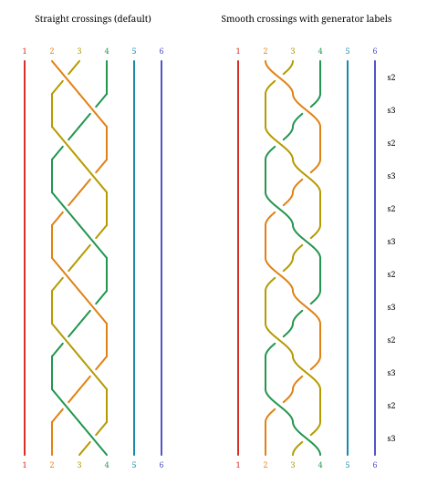

For a continuous braid beside factor rows, set
`FactorizationDiagram(..., braid_crossing_style="smooth")`. This is the first
static rendering option informed by the
[Tiny Bubbles Lab factor-5 display](https://tiny-bubbles-lab.joshgay.chatgpt.site/research-journal/2026-09-09-simplified-crossing-audit/#factor-5).
Add `show_generators=True` to `BraidDiagram` for right-hand labels such as
`s2` and `s2^-1`, aligned with each crossing. Use
`braid_show_generators=True` on `FactorizationDiagram` for the same labels
beside factor blocks. Labels follow the supplied traversal order, skip identity
blocks and connectors, and work with straight or smooth crossings in SVG and
TikZ. They do not change the braid. Highlighted atom bands and interactive zoom
controls remain pending. JSON recipes accept
`braid.crossing_style`; the browser editor exposes it as **Crossing style**.
Recipes also accept the boolean `braid.show_generators` (default `false`) and
preserve it through save/reopen and exports. In the editor, enable **Show
generator labels** below Crossing style; the change supports undo and redo.

Use `BraidDiagram(3, (1, 2), direction="bottom-to-top")` to traverse the supplied
word upward instead. The first entry is now the bottom crossing. Signs still use
the same **upper-end** convention: a positive crossing followed upward takes the
lower-left strand under the lower-right strand. Direction changes neither the
sign of a generator nor the supplied word; it is not a mirror-image operation.

Write down your multiplication convention alongside a factorization. If the
rows are operations f1 then f2 in chronological order and maps compose
right-to-left, the final action is f2*f1. A literal word f1*f2 is a different
ordering convention. The panel labels do not silently resolve that difference.

For a manually assembled top-to-bottom action sequence, put the initial C at
the top, then supplied states f1(C), f2(f1(C)), and so on below. Reuse colors by cut ID. A caption saying
"identity" is not an equality check: comparing the final cut system to C requires
isotopy and a justified rigidity convention. These remain calculation tasks.

### Ordered factor rows with a continuous braid

`FactorizationDiagram` handles ordering, factor IDs, grouping and row alignment.
Its factors are supplied in **application order**. It draws bottom to top by
default: for `(a, b)`, a is the bottom factor and acts first, while the displayed
right-to-left product is `b*a`. Set `direction="top-to-bottom"` for a descending
presentation of the same application sequence. Product order stays unchanged.

```python
from surface_diagrams import FactorPanel, FactorizationDiagram, TypeIBoundary

small = PlanarSurface.row("PPP", spacing=45, height=100, margin=40)
a_support = PlanarDiagram(small, (
    ColoredCurve("c1", Arc(1, 2), RAINBOW[0]),
))
b_support = PlanarDiagram(small, (
    ColoredCurve("c2", Arc(2, 3), RAINBOW[4]),
))
ordered = FactorizationDiagram((
    FactorPanel("a", Panel(a_support, "Half twist on c1"),
                braid_word=(1,), group="block A"),
    FactorPanel("b", Panel(b_support, "Inverse half twist on c2"),
                exponent=-1, braid_word=(-2,), group="block A"),
    FactorPanel("a-again", Panel(a_support, "Same support; distinct factor ID"),
                braid_word=(1,), group="block B"),
), strands=3, braid_spacing=36)
save_svg(ordered, "ordered-factorization.svg")
save_tikz(ordered, "ordered-factorization.tikz")
```

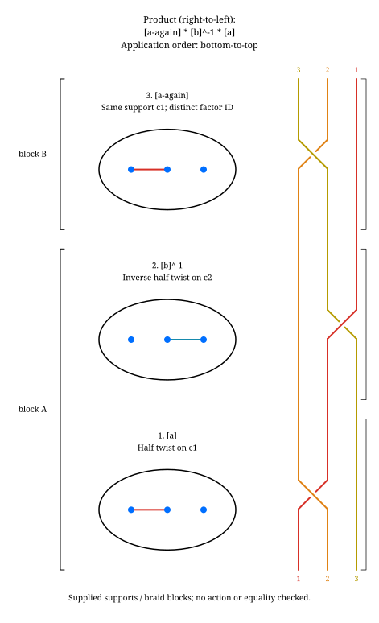

The adjacent braid is continuous: strand colors and endpoint identities are
transported through every block and the intervening space. Its crossing signs
use the fixed upper-end convention above. Each block gets enough height for its
supplied crossings; support diagrams are never rescaled. Repeated support curves
are allowed, but each factor needs a distinct ID. Reusing a support keeps its
cut IDs, colors, dashing and full itinerary. Group names label contiguous blocks;
reusing a group name after an intervening group is rejected.

`braid_word` is the **complete supplied block**, including any exponent or
inverse already encoded by the caller. The renderer does not exponentiate a
word, derive a lift, cancel adjacent inverse crossings, or verify that it matches
the support. With `strands` set, every factor must provide a block: `()` means
straight strands, whereas `None` means no block was supplied and is rejected.
Omit `strands` and all braid words for a surface-only sequence. An empty factor
sequence displays product `1` and, if requested, straight strands.

### Supplied action states on bordered surfaces

To add an aligned state column, supply `initial_state=Panel(...)` and a
`state=Panel(...)` for **every** factor. A factor's state is the supplied image
after that factor, never an image computed by this renderer. Missing intermediate
states are rejected so the drawing cannot silently skip an action step.

```python
bordered = GenusSurface(2, type_i=(TypeIBoundary(6),)).with_reference_arcs()
subset = bordered.select(2, 4)
actions = FactorizationDiagram((
    FactorPanel("t2", Panel(bordered.select(2), "Twist on member 2"),
                state=Panel(subset, "Selected members 2 and 4")),
    FactorPanel("t4", Panel(bordered.select(4), "Inverse twist on member 4"),
                exponent=-1, state=Panel(subset, "Selected members 2 and 4")),
), initial_state=Panel(subset, "Two disjoint members only"))
save_svg(actions, "supplied-action-states.svg")
save_tikz(actions, "supplied-action-states.tikz")
```

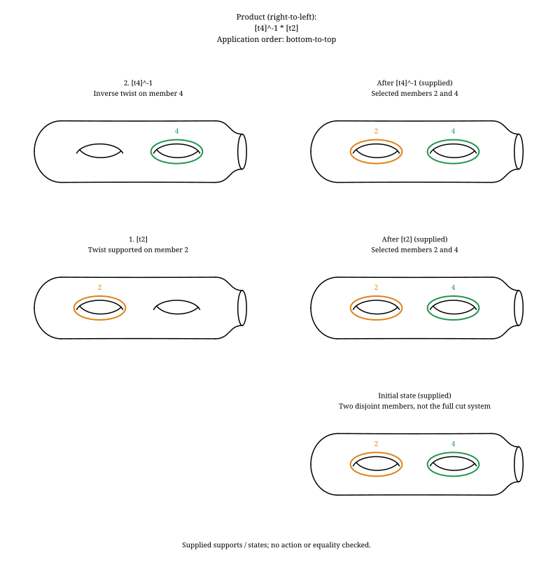

Here the two disjoint support members remain unchanged under twists about either
member. This is only a selected subset, **not** a filling reference system;
unchanged pictures do not show that the product is the identity. No action,
Hurwitz move, substitution or equality algorithm is implemented by these panels.

## 9. Use case 2: standard nonplanar surfaces and their cuts

```python
genus_two = GenusSurface(2)
save_svg(genus_two.with_cut_system(), "standard-genus-cuts.svg")
```

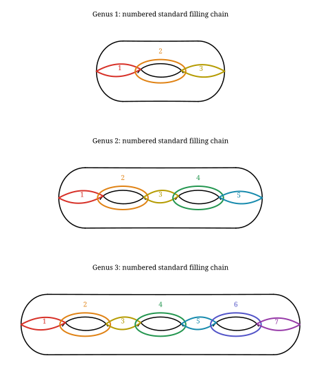

The default view is **above/right**, with closed reference curves drawn solid.
Use `with_cut_system(closed_curve_style="split")` or
`with_curves(NamedCut(2), closed_curve_style="split")` to retain rear corridor
dashing. The enclosing loops remain solid because they do not cross a silhouette
edge. Explicit `DiskRoute` visibility still follows its supplied mesh itinerary.

The current standard system is a numbered **2g+1 filling chain**, not a collection
of g disjoint Heegaard meridians. Its members intersect, and its complement has
two disks. `with_cut_system()` colors its numbered members consistently. The optional corridor dashing follows the chosen viewpoint. Reversing the view must not rename the cuts.

The current checked closed-surface route binding covers the standard genus 1-7
presentations. `view_vertical="above"` or `"below"`, and
`view_horizontal="left"` or `"right"`, select the viewpoint. Genus holes are not
boundary components. The misleading extra handle arc and `handle_style` option
have been removed.

For a known chain member, you do not need mesh coordinates:

```python
from surface_diagrams.genus_diagrams import NamedCut
save_svg(genus_two.with_curves(NamedCut(2)), "known-closed-curve.svg")
```

For an arc between marks:

```python
from surface_diagrams import MarkedArc
marked = GenusSurface(2, marks=("P", "Q"))
arc = MarkedArc("P", "Q", id="PQ")
save_svg(marked.with_curves(arc), "marked-arc.svg")
```

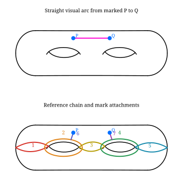

`MarkedArc` draws the straight segment in the clear upper band, using the actual
mark positions. It rejects an obstructing intermediate mark or a segment outside
that band. For a specific winding/crossing sequence use `DiskRoute` with
`MarkPoint` endpoints instead; it preserves its chart itinerary and can bend.
These are distinct inputs: a supplied straight visual arc is not silently
substituted for an explicitly specified disk route.

## 10. Find the inputs for a general genus route

`DiskRoute` describes a route through the disks obtained by cutting. It uses a
more detailed locator than the planar integer intervals:

| Input | Meaning |
| --- | --- |
| `Crossing(side, t)` | Cross one oriented side occurrence at fraction t, with 0 < t < 1 |
| `MarkPoint("P")` | End at the specified marked point; use a corner locator when its copy is ambiguous |
| `BoundaryPoint(side, t)` | End on an original unglued boundary side in a supported cut atlas |
| Both endpoints omitted | A closed route, whose last piece must close consistently |
| `id="alpha"` | Stable identity used to declare intersections between routes |

A parent cut number can cover many subdivided segments and two side copies.
Consequently, "cross cut 2" can be ambiguous. The library reports that ambiguity
instead of choosing an arbitrary side.

```python
from surface_diagrams.disk_routes import CutAtlas, Crossing, DiskRoute, MarkPoint
system = genus_two.cut_system()
atlas = CutAtlas.build(system)
save_svg(system.diagram(show_segments=True), "numbered-segment-locators.svg")
for parent in system.cellulation.parents:
    print(parent.number, parent.kind, parent.walk)
```

Start with `NamedCut` when possible. Otherwise inspect the disk diagram, choose
the oriented side encountered by your route, choose a position away from corners,
and enter the crossings in order. `atlas.cross(Crossing(side, t))` gives the
paired side at `1-t`. Validate the route with `atlas.route(route)` and draw it
both on the surface and with `system.diagram(route)`.

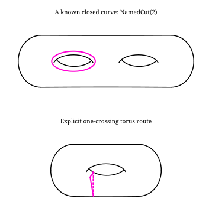

Open the [full-size cut-disk diagnostic](../examples/output/tutorial/09-torus-cut-disk-detail.svg)
to see the same route in its chart. This dense mesh has many side occurrences;
zoom the standalone SVG to read their labels. It is kept separate so it does not
shrink the surface diagrams into unreadable thumbnails.

The guide label `2.1+` means cut 2, segment 1, bank `+`. Use the matching input:

```python
torus = GenusSurface(1)
torus_system = torus.cut_system()
torus_atlas = CutAtlas.build(torus_system)
crossing = torus_atlas.crossing_on_cut(2, segment=1, bank="+", position=.37)
loop = DiskRoute((crossing,), id="torus-loop")
torus_atlas.route(loop)
save_svg(torus.with_curves(loop), "numbered-torus-loop.svg")
save_svg(torus_system.diagram(loop, show_segments=True), "numbered-torus-guide.svg")
```

Segments follow the parent cut's walk, numbered from 1; `+` and `-` identify the
paired sides. Position runs from 0 to 1 along the chosen oriented side, so crossing
to the other bank reverses it to `1-t`. Use `atlas.cross(crossing)` for that operation.
The plus/minus bank labels do not mean front/back visibility or twist sign.

This is an explicit worked route, not an algorithm for selecting any desired
homotopy class. Segment numbers and raw side IDs depend on the cellulation; do not
reuse them with another genus or mesh. `show_ids=True` still reveals the raw IDs.

For genus intersections, use the existing explicit piece declarations, such as
`intersections=((('alpha', 0), ('beta', 0)),)`, in `with_curves` and the disk
preview. See [make_genus_cuts.py](../examples/make_genus_cuts.py) for a complete
intersecting example. A projected crossing between front and back sheets does
not by itself mean the surface curves intersect.

## 11. Boundary templates and vertical action sequences

`boundary_guide()` labels the actual rim intersections with the vertical plane.
The short drawing labels (1a, 1b, etc.) map to boundary IDs in the legend. Banks
`a` and `b` follow each rim's tangent orientation; they do not mean front/back,
twist sign, or the banks of the numbered cut-disk segments.

```python
from surface_diagrams import TypeIBoundary
boundary_surface = GenusSurface(2, type_i=(TypeIBoundary(6),))
save_svg(boundary_surface.boundary_guide(), "boundary-attachments.svg")
for attachment in boundary_surface.boundary_anchors():
    print(attachment.id, attachment.point)
attachment = boundary_surface.boundary_anchor("fixed-6", "a")
```

Type I boundaries at outer ends or genus cusps now have a reference-arc drawing:

```python
end_bordered = GenusSurface(2, type_i=(TypeIBoundary(1), TypeIBoundary(6)))
save_svg(end_bordered.with_reference_arcs(), "end-boundary-reference.svg")
save_tikz(end_bordered.with_reference_arcs(), "end-boundary-reference.tikz")
```

The end members attach to the front and rear of the rim, as a vertical
slice through the handle would. Internal chain members keep their IDs and colors.
An opened genus cusp uses a rounded enclosure around its actual hole and rim.
These are supplied reference drawings, not certified bordered `CutSystem` charts.

Type II reference arcs connect boundaries along the perimeter. They never end
on the middle of another curve. A side-pair connection continues across the
axis and crosses the left/right end loop; upper and lower arcs follow the
outline inward, connecting consecutive rims. `pair_bank` is retained for source
compatibility, but both banks participate in the perimeter family.

```python
from surface_diagrams import BoundaryPair
top_pairs = GenusSurface(2, type_ii=(BoundaryPair("top"),))
save_svg(top_pairs.with_reference_arcs(), "type-ii-perimeter.svg")
```

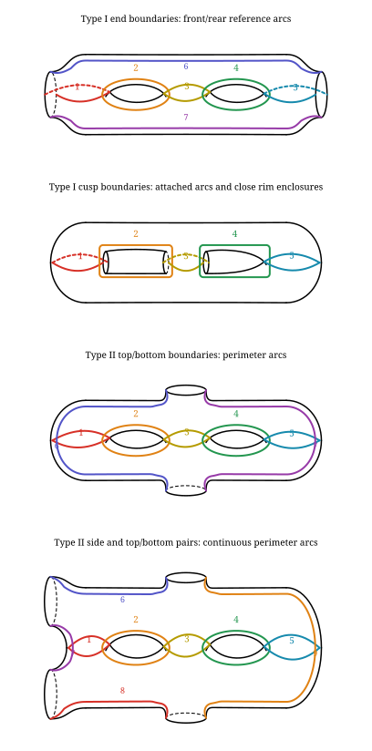

Closed reference curves default to solid. Use
`with_reference_arcs(closed_curve_style="split")` to dash rear corridor halves.
The hole-enclosing loops stay solid in either mode: their present paths do not
cross a silhouette edge, so a solid/dashed transition there would be misleading.
The same option is available on `with_cut_system()` and `with_curves()` for
closed named reference curves. Mesh-bound marked points retain their existing
positions until their presentation is migrated.

Marks split the perimeter into consecutive arcs. Automatic positions place a
single unpaired mark on the symmetry axis and consecutive pairs above/below
at matching x coordinates. For an odd count, the first name is the axial mark.

```python
marked_border = GenusSurface(2, type_i=(TypeIBoundary(6),), marks=("P", "Q"))
marked_reference = marked_border.with_reference_arcs()
save_svg(marked_reference, "bordered-marked-reference.svg")
```

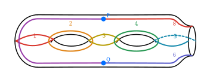

The same symmetry convention is available on **closed** genus surfaces:

```python
axial = GenusSurface(2, marks=("M",)).with_reference_arcs()
paired = GenusSurface(2, marks=("P", "Q")).with_reference_arcs()
combined = GenusSurface(2, marks=("M", "P", "Q")).with_reference_arcs()
save_svg(combined, "symmetric-genus-marks.svg")
# Keep the marks and outline, hiding the reference curves:
save_svg(combined.select(), "marked-surface-only.svg")
```

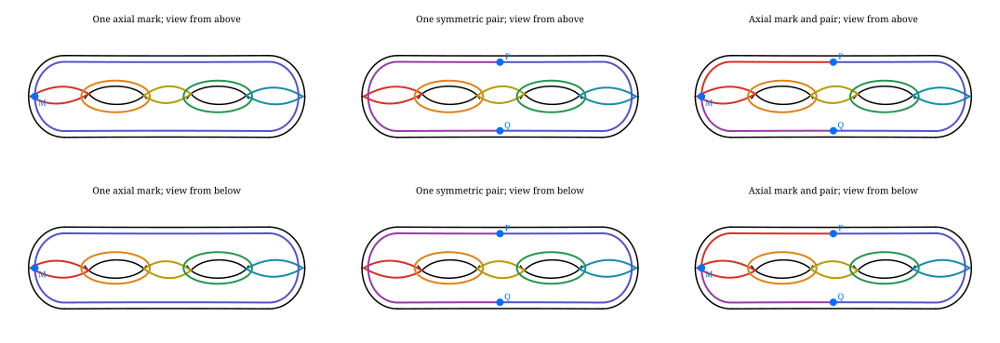

For three marks, the first name is the axial point and the remaining two form
the upper/lower pair. Reversing the view keeps their names and positions. Reference numbers are
hidden in this comparison with `.with_labels(reference=False)`.
Each mark divides the continuous perimeter into two incident arcs; there is no
spoke ending on a closed curve. The figure shows reference curves, not a
certified cut-system decomposition or a computed mapping-class action.

Use this reference API when preparing symmetric marked-surface illustrations.
The older `with_cut_system()` and `with_curves(DiskRoute(...))` views still use
mesh-bound mark positions. Switching between the two views is not a route
conversion: an explicit route must retain its mesh endpoints until that
migration is implemented.

For a deliberately supplied placement, `mark_positions` accepts every mark ID
exactly once and preserves those coordinates. The nearby perimeter deforms
through the marks instead of adding spokes. Such explicit positions override
the automatic symmetry convention. Points outside the surface, inside genus
openings, or overlapping another mark are rejected. Automatic axial placement
requires an available end. These drawings still do not certify a marked
bordered cellulation or change the separate mesh-based mark-placement API.

Use `.select(...)` to isolate existing reference members for factor panels:

```python
family = end_bordered.with_reference_arcs()
factor_panels = Figure((
    (Panel(family.select(2), "Factor 1: positive twist on member 2"),),
    (Panel(family.select(4), "Factor 2: positive twist on member 4"),),
    (Panel(family, "Reference family; action images not supplied"),),
))
save_svg(factor_panels, "bordered-factor-panels.svg")
```

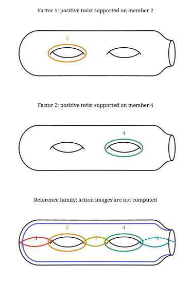

`family.member_numbers` lists the available member numbers. Selection preserves
geometry, colors and all marked points. An opened odd member includes both of its
boundary arcs; an even member is its closed wrap. Perimeter arcs receive later
numbers, each split at a mark creating another member. These replace the old
spoke numbers; query the family rather than reusing those numbers. An empty selection leaves the surface and marks.
This draws supplied support curves and labels; it does not apply the factors or
check their product.

A side Type II pair and a Type I rim on the opposite end can be combined with
top/bottom pairs and explicit marks. IDs and colors persist in all four views:

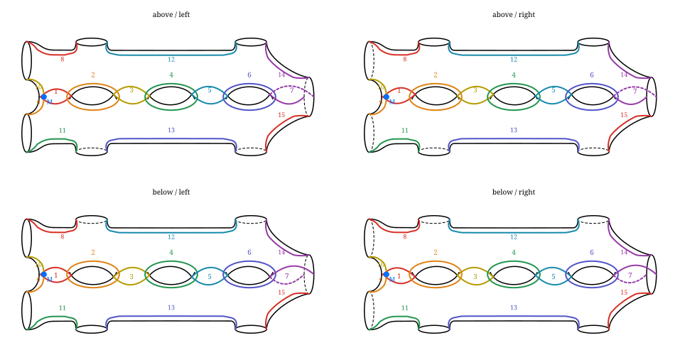

`boundary_guide()` identifies exact rim attachment points; `with_reference_arcs()`
draws the supported reference curves and perimeter arcs shown
above. These presentation drawings do not supply a certified cut-disk chart:
`cut_system()` still rejects bordered surfaces.


```python
from surface_diagrams import TypeIBoundary, BoundaryPair
bordered = GenusSurface(2, type_i=(TypeIBoundary(6),))
paired = GenusSurface(2, type_ii=(BoundaryPair("left"), BoundaryPair("top")))
save_svg(Figure(((Panel(bordered, "One Type I boundary"),),
                 (Panel(paired, "Four Type II boundaries"),))), "templates.svg")
```


Boundary outlines and supported reference drawings work. **Certified cut-system
binding and general DiskRoute routing on Type I/II surfaces remain unsupported.**
Finishing them is ahead of the calculation engine. The
experimental cusp patch is not part of the public API.

A vertical sequence of nonplanar panels uses the same `Figure` recipe as the
planar case. Supply each intermediate curve system and its labels. Automatically
applying mapping classes to the standard system and proving identity remains
pending; the tutorial does not fabricate transformed curves.

## 12. Use case 3: Hurwitz moves, substitutions, cyclic shifts

The new layout tools can already display original and replacement products.
You supply the replacement factors; there is no general rewrite engine yet.

For the written product ab, one Hurwitz convention is
`(a,b) -> (b,b^-1*a*b)`. Its product is still ab. For right-handed twists,
conjugating the second factor transports its support curve by b^-1.

```python
move = Figure((
    (Panel(BraidDiagram(3, (1,2)), "Original word"),
     Panel(BraidDiagram(3, (2,-2,1,2)), "After (a,b) -> (b,b^-1 a b)")),
    (Panel(BraidDiagram(3, (1,2,1)), "Braid relation: left"),
     Panel(BraidDiagram(3, (2,1,2)), "Braid relation: right")),
))
save_svg(move, "rewrites.svg")
```


Keep the grouping of `(b, b^-1*a*b)` in its factor labels even though the braid
picture expands the second factor into three crossings. Substitutions need an
explicit relation between the replaced blocks, with the same ambient surface
and endpoint/boundary conventions. Keep a record of which relation was used.

A cyclic shift is not unconditional equality of based products. If
W = a1*a2*...*an, the shifted word a2*...*an*a1 equals a1^-1*W*a1.
It preserves W when W is the identity or commutes with a1, including when W is
central. Otherwise label it as conjugation or a change of basepoint when that is
the intended equivalence. Future automatic moves must check this condition.

## 13. Use case 4: homology, basis changes, fundamental groups

This calculation work follows the visualization milestones. The inputs should
be explicit, so we can already design its eventual figures without guessing.

| Calculation | Required input | Planned output |
| --- | --- | --- |
| Surface homology | An oriented surface/cellulation; whether points are retained or removed; coefficient ring | Generators, relations and basis curves |
| Change of basis | Ordered old/new bases and an orientation convention | Exact change-of-basis matrix alongside the colored bases |
| Induced homology action | A mapping class with a supported curve action | Matrix and images of basis curves |
| Fundamental group presentation | A connected cellulation, basepoint and maximal tree | Generators from remaining edges; relators from attaching face boundaries |
| Action on fundamental group | Based paths and basepoint transport | Generator words, or an outer automorphism when only an unbased map is specified |

For a connected compact orientable surface with b >= 1 boundary components,
H1 has rank 2g+b-1, and the fundamental group is free of that rank. For a closed
genus-g surface, H1 has rank 2g and the familiar presentation has generators
ai, bi with the single relation product [ai,bi] = 1. Retained marked points do
not change the underlying surface's homology; removed punctures do.

Thus a surface fundamental-group **presentation** is a reasonable feature, not
an open-ended research problem. This does not promise automatic recognition of
arbitrary groups arising from 4-manifolds. The cellular construction is described
in [Hatcher's Algebraic Topology, Chapters 1 and 2](https://pi.math.cornell.edu/~hatcher/AT/ATpage.html).

Use exact integer matrices for integral bases. If columns of P are new basis
vectors written in the old basis, coordinate columns satisfy x_old = P*x_new,
and an action matrix changes by A_new = P^-1*A_old*P. A genuine integral basis
change has determinant +1 or -1. Homology agreement alone cannot certify equality
of mapping classes.

## 14. Use case 5: Lefschetz-fibration signatures and other invariants

This is a concrete later calculation target. Ozbagci gives a signature method
using global monodromy; Cengel and Karakurt reformulate it for implementation and
include bordered Lefschetz fibrations over the disk.
[Ozbagci](https://arxiv.org/abs/math/9809178),
[Cengel-Karakurt](https://arxiv.org/abs/1907.11507).

Record the oriented fiber, whether it has boundary, the base, the ordered
vanishing cycles, twist signs, multiplication convention, and any completion or
gluing data. For a fibration over S2, include and check the necessary global
monodromy relation. An arbitrary drawn factorization is not automatically such
a fibration. Counts of separating/nonseparating cycles are insufficient for a
general signature formula; special formulas need their hypotheses checked.

The eventual display should put the ordered factor diagram beside a trace of
its exact calculation and the final signature. Start with a known worked example,
not a universal `signature()` accepting every diagram. Natural accompanying
outputs include Euler characteristic and, within a specified handle model,
homology and a fundamental-group presentation. Which other invariants follow
must be stated with their assumptions. None of these are implemented by this tutorial.

## 15. Supplied marked arcs on bordered surfaces

Add straight `MarkedArc` objects to a bordered reference family. Each arc stays
in the clear upper or lower band containing both endpoints. The reference
members remain guides, so an arc may cross them. Use `select()` to hide all
reference members while retaining the supplied arcs and marked points.
For a less crowded diagram, `arcs.with_labels(reference=False)` keeps the
colored reference curves but hides their numbers; marked-point names remain.
Call `.with_labels()` to restore the numbers.

```python
from surface_diagrams import GenusSurface, TypeIBoundary, BoundaryPair, MarkedArc

marked = GenusSurface(2, type_i=(TypeIBoundary(6),),
                      type_ii=(BoundaryPair('left'),), marks=('P','Q','R','S'))
reference = marked.with_reference_arcs(mark_positions={
    'P':(-35,30), 'Q':(35,30), 'R':(-35,-30), 'S':(35,-30)})
arcs = reference.with_curves(MarkedArc('P','Q'), MarkedArc('R','S'))
save_svg(arcs, 'bordered-marked-arcs.svg')
save_tikz(arcs.select(), 'bordered-marked-arcs.tikz')
```

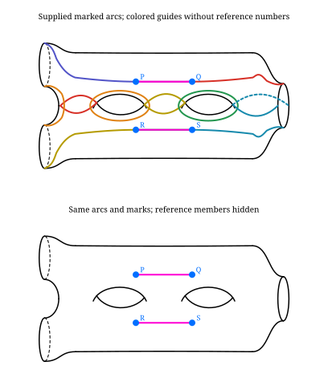

Unknown endpoints, duplicate arc IDs, intervening marks, overlapping arcs,
and endpoints in opposite bands are rejected. Crossings are rejected by default. Consecutive arcs may share
an endpoint. These are supplied solid presentation arcs, not computed images
or cut-disk routes; general bordered routing and certified Type I/II bindings
remain unfinished. All four viewing directions and both exporters are supported.

For a supplied intersecting family, opt in explicitly. These are transverse
surface intersections, with no braid over/under convention and no computed action.
The option survives `.select()` and subsequent `.with_curves()` calls; use
`allow_intersections=False` to restore disjointness checking.

```python
crossing_family = GenusSurface(2, type_i=(TypeIBoundary(6),),
    marks=('P','Q','R','S')).with_reference_arcs(mark_positions={
        'P':(-50,28), 'Q':(50,36), 'R':(-25,36), 'S':(25,28)})
crossing_arcs = crossing_family.with_curves(
    MarkedArc('P','Q',color='#d73027'), MarkedArc('R','S',color='#168aad'), allow_intersections=True)
save_svg(crossing_arcs.select(), 'bordered-intersections.svg')
```

To inspect a crossing, draw each arc separately on the **same** marked surface,
then place the overlay below them. Reusing `crossing_family` keeps point positions,
view direction and surface geometry identical in every row:

```python
comparison = Figure((
    (Panel(crossing_family.with_curves(MarkedArc('P','Q',color='#d73027')).select(), 'Arc P-Q'),),
    (Panel(crossing_family.with_curves(MarkedArc('R','S',color='#168aad')).select(), 'Arc R-S'),),
    (Panel(crossing_arcs.select(), 'Both arcs on the same surface'),),
))
save_svg(comparison, 'bordered-arc-comparison.svg')
save_tikz(comparison, 'bordered-arc-comparison.tikz')
```

`MarkedArc(..., color='#d73027')` keeps an arc's color fixed across panels,
even when the figure style changes. Omit `color` to use `Style.curve_color`.
Both closed and bordered genus presentations support these colors in SVG and TikZ.

These rows isolate the inputs; they are not successive images under a mapping
class. An action-state sequence must supply its actual intermediate curves.

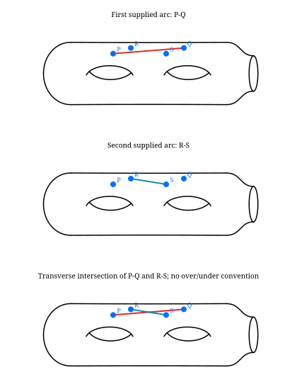

## 16. What to work on next

| Priority | Deliverable |
| --- | --- |
| First | Stronger intersecting-family layouts, stable visual IDs and rainbow legends |
| Next | Finish standard Type I/II cut-system and route drawings; easier route locators and input previews |
| Available | Application-ordered factor/action rows, stable factor IDs and groups, continuous supplied braid blocks, SVG/TikZ parity |
| Next | Further supplied Hurwitz/substitution examples and remaining nonplanar route bindings |
| Next | Complete exports and polish core surface, braid and factorization displays |
| Later | Automatic actions/equality and rewrite checks; homology/basis/fundamental-group calculations; Lefschetz invariants |

The shared mathematical records can grow as these drawings need them. A general
coordinate engine, cover solver or theorem about uniqueness is not a prerequisite
for drawing a supplied configuration. See the [controlling plan](IMPLEMENTATION_PLAN.md)
for the current visualization-first order.

Heegaard, bridge, trisection and Kirby diagram families are deferred until a
concrete use case arises and are excluded from the core display scope.

Even-wrap visibility now changes exactly on the projected line through the hole
cusps, matching the neighboring odd cuts. The transition is not the horizontal
y=0 line. Type I/II boundary and marked-point cut arcs are to lie in the vertical
plane; their full presentation bindings remain under development.
